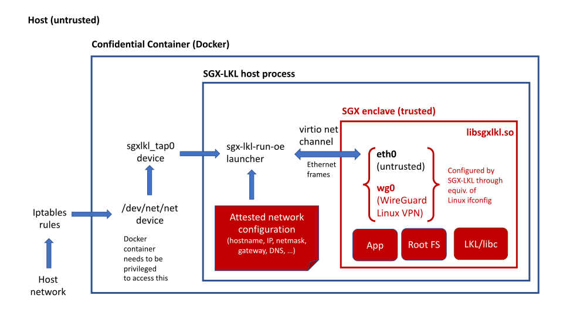

Networking support in SGX-LKL-OE
================================

Overview of current SGX-LKL networking
-----------------------------------------

The following figure gives an overview of networking in SGX-LKL:



Everything shown in red is trusted; everything else is considered untrusted.

## Host side networking

### TAP device

The launcher `sgx-lkl-run-oe` uses a single Linux TAP device (by default called `sgxlkl_tap0`) for all the host-side networking. A Linux TAP device is a virtual layer-2 network device, which can be used exclusively by a process.

SGX-LKL currently expects that this device has been set up by the `sgx-lkl-setup` script. The launcher then accesses the device by opening `/dev/net/tun`, which is the Linux interface for interacting with TAP devices.

The TAP device is exposed to the enclave through the VirtIO net mechanism as a network device, which can be accessed through a shared memory region.

### Setting up host side networking

The following networking setup is done automatically when running the `sgx-lkl-setup` command.

For SGX-LKL applications to send and receive packets via the network, a TAP interface is needed on the host. It can be created manually as follows:
```
sudo ip tuntap add dev sgxlkl_tap0 mode tap user `whoami`
sudo ip link set dev sgxlkl_tap0 up
sudo ip addr add dev sgxlkl_tap0 10.0.1.254/24
```

SGX-LKL uses the IP address `10.0.1.1` by default. To change it, update the app_config or set the environment variable `SGXLKL_IP4`. The name of the TAP interface is set using the environment variable `SGXLKL_TAP`.

To communicate with an SGX-LKL enclave from a different host or allow an application to reach other hosts, `iptable` rules to forward the corresponding traffic are needed:
```
# Enable packet forwarding
sudo sysctl -w net.ipv4.ip_forward=1
# Forward traffic to enclave attestation endpoint
sudo iptables -t nat -I PREROUTING -p tcp -i eth0 --dport 56000 -j DNAT --to-destination 10.0.1.1:56000
# Forward traffic to enclave Wireguard endpoint
sudo iptables -t nat -I PREROUTING -p udp -i eth0 --dport 56002 -j DNAT --to-destination 10.0.1.1:56002

# Allow forwarding to/from TAP
sudo iptables -I FORWARD -m state -d 10.0.1.0/24 --state NEW,RELATED,ESTABLISHED -j ACCEPT
sudo iptables -I FORWARD -m state -s 10.0.1.0/24 --state NEW,RELATED,ESTABLISHED -j ACCEPT

# If enclave needs establish new connections to external hosts, masquerade
# outgoing traffic from enclave
sudo iptables -t nat -A POSTROUTING -s 10.0.1.0/24 ! -d 10.0.1.0/24 -j MASQUERADE
```

An SGX-LKL application can be made publicly accessible by adding rules that forward traffic. For example, the following rule allows external clients to connect to a Redis instance on the default port 6379 running with SGX-LKL:
```
# Forward traffic from host's public interface TCP port 60321 to SGX-LKL port 6379
sudo iptables -t nat -I PREROUTING -p tcp -d `hostname -i` --dport 60321 -j DNAT --to-destination 10.0.1.1:6379
```

## Enclave side networking

Inside the enclave, SGX-LKL creates multiple Linux network interfaces, which are available to be used by the application. The following shows the network interfaces that are exposed:
```
# Create an SGX-LKL root file system based on the default Alpine Linux image
$ sgx-lkl-disk create --size=20M --alpine="" disk.img
# Run `ifconfig` inside an SGX-LKL enclave
$ SGXLKL_TAP=sgxlkl_tap0 sgx-lkl-run-oe --hw-debug ./disk.img /sbin/ifconfig
eth0      Link encap:Ethernet  HWaddr CA:FE:00:00:00:01
          inet addr:10.0.1.1  Bcast:0.0.0.0  Mask:255.255.255.0
          inet6 addr: fe80::c8fe:ff:fe00:1/64 Scope:Link
          UP BROADCAST RUNNING MULTICAST  MTU:1500  Metric:1
          RX packets:6 errors:0 dropped:0 overruns:0 frame:0
          TX packets:0 errors:0 dropped:0 overruns:0 carrier:0
          collisions:0 txqueuelen:1000
          RX bytes:516 (516.0 B)  TX bytes:0 (0.0 B)

lo        Link encap:Local Loopback
          inet addr:127.0.0.1  Mask:255.0.0.0
          inet6 addr: ::1/128 Scope:Host
          UP LOOPBACK RUNNING  MTU:65536  Metric:1
          RX packets:0 errors:0 dropped:0 overruns:0 frame:0
          TX packets:0 errors:0 dropped:0 overruns:0 carrier:0
          collisions:0 txqueuelen:1000
          RX bytes:0 (0.0 B)  TX bytes:0 (0.0 B)

wg0       Link encap:UNSPEC  HWaddr 00-00-00-00-00-00-00-00-00-00-00-00-00-00-00-00
          inet addr:10.0.2.1  P-t-P:10.0.2.1  Mask:255.255.255.0
          UP POINTOPOINT RUNNING NOARP  MTU:1420  Metric:1
          RX packets:0 errors:0 dropped:0 overruns:0 frame:0
          TX packets:0 errors:0 dropped:0 overruns:0 carrier:0
          collisions:0 txqueuelen:1000
          RX bytes:0 (0.0 B)  TX bytes:0 (0.0 B)
```
**eth0 interface**

The `eth0` interface is the "public" network interface inside of the enclave that relays packets unencrypted to the outside (i.e. through the TAP device). It is configured at SGX-LKL boot time like any other Linux network interface with an IP address/netmask/default gateway etc.

The configuration for `eth0` is currently provided as part of the app_config, and therefore included in the attestation. 

**wg0 interface**

SGX-LKL also uses the Wireguard VPN for protecting all network traffic between SGX-LKL instances. For this, SGX-LKL creates a `wg0` interface, which sends traffic over an encrypted Wireguard VPN. The Wireguard VPN is set up insiude the enclave, as defined in the app_config, and allows SGX-LKL instances to communicate securely via their own VPN.

See [Network encryption](https://github.com/lsds/sgx-lkl/wiki/Network-encryption) for *outdated* information on how to set it up and use it.

**lo interface**

This is a regular Linux loopback interface.

### DNS resolution

DNS resolution is configured via `/etc/resolv.conf` in the root file system, as usual. A valid nameserver configuration must be in place on the root disk image, e.g. by copying the host configuration. This is done automatically by `sgx-lkl-disk` when the root disk image is created.

The handling of DNS is undergoing changes:

- In previous work, PR https://github.com/lsds/sgx-lkl-musl-oe/pull/21 adds default DNS servers to SGX-LKL that are used for network communication (e.g., for attestation) before the root file system has been mounted.
- In ongoing work, the DNS information will be obtained from the attested app_config, overriding what is specified on the root file system.
